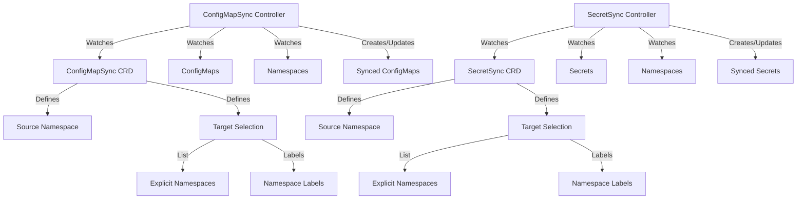

# Syncer Operator

The Syncer Operator is a Kubernetes operator that provides two Custom Resources to synchronize ConfigMaps and Secrets across namespaces. Built using the Operator SDK framework, it offers flexible and secure resource synchronization capabilities.

## Features

- ConfigMapSync: Sync multiple ConfigMaps from source namespace to target namespaces
- SecretSync: Sync multiple Secrets from source namespace to target namespaces
- Automatic reconciliation when source resources change
- Independent control over ConfigMap and Secret synchronization
- Granular RBAC permissions
- Target namespace selection by:
  - Explicit namespace list
  - Label selector
  - Both (combined targeting)

## Architecture



## Installation

1. Install the operator:
   ```bash
   make deploy IMG=your-registry/syncer:tag
   ```

2. Create a ConfigMapSync resource with label selector:
   ```yaml
   apiVersion: syncer.containeers.com/v1alpha1
   kind: ConfigMapSync
   metadata:
     name: my-config-sync
     namespace: default
   spec:
     sourceNamespace: source-ns
     targetNamespaces:
       - target-ns1
       - target-ns2
     targetNamespaceSelector:
       matchLabels:
         environment: staging
         sync-enabled: "true"
     configMaps:
       - name: config1
       - name: config2
   ```

3. Create a SecretSync resource with label selector:
   ```yaml
   apiVersion: syncer.containeers.com/v1alpha1
   kind: SecretSync
   metadata:
     name: my-secret-sync
     namespace: default
   spec:
     sourceNamespace: source-ns
     targetNamespaces:
       - target-ns1
       - target-ns2
     targetNamespaceSelector:
       matchLabels:
         environment: staging
         sync-enabled: "true"
     secrets:
       - name: secret1
       - name: secret2
   ```

## How it Works

### ConfigMapSync Controller
1. Watches for ConfigMapSync resources
2. Monitors specified ConfigMaps in source namespace
3. Watches for namespace changes (for label-based targeting)
4. Determines target namespaces by:
   - Including explicitly listed namespaces
   - Including namespaces matching label selector
5. Synchronizes ConfigMaps to all target namespaces
6. Updates status with sync information

### SecretSync Controller
1. Watches for SecretSync resources
2. Monitors specified Secrets in source namespace
3. Watches for namespace changes (for label-based targeting)
4. Determines target namespaces by:
   - Including explicitly listed namespaces
   - Including namespaces matching label selector
5. Synchronizes Secrets to all target namespaces
6. Updates status with sync information

## Development

1. Clone the repository:
   ```bash
   git clone https://github.com/containeers/syncer
   ```

2. Install dependencies:
   ```bash
   go mod tidy
   ```

3. Run locally:
   ```bash
   make install run
   ```

## RBAC Permissions

The operator creates two separate ServiceAccounts with different permissions:
- ConfigMapSync controller: Access to ConfigMaps and namespace list/watch
- SecretSync controller: Access to Secrets and namespace list/watch

This separation ensures better security by following the principle of least privilege.

## Sample Usage

### Label Your Namespaces
```bash
# Label namespaces for targeting
kubectl label namespace dev environment=dev sync-enabled=true
kubectl label namespace staging environment=staging sync-enabled=true
kubectl label namespace qa environment=qa sync-enabled=true
```

### Sync ConfigMaps Using Labels
```yaml
apiVersion: syncer.containeers.com/v1alpha1
kind: ConfigMapSync
metadata:
  name: app-config-sync
spec:
  sourceNamespace: prod
  # Optional explicit namespace list
  targetNamespaces:
    - always-sync-ns
  # Label selector for dynamic targeting
  targetNamespaceSelector:
    matchLabels:
      environment: staging
      sync-enabled: "true"
    matchExpressions:
      - key: environment
        operator: In
        values: ["dev", "staging"]
  configMaps:
    - name: app-config
    - name: feature-flags
```

### Sync Secrets Using Labels
```yaml
apiVersion: syncer.containeers.com/v1alpha1
kind: SecretSync
metadata:
  name: app-secret-sync
spec:
  sourceNamespace: prod
  # Optional explicit namespace list
  targetNamespaces:
    - always-sync-ns
  # Label selector for dynamic targeting
  targetNamespaceSelector:
    matchLabels:
      environment: staging
      sync-enabled: "true"
    matchExpressions:
      - key: environment
        operator: In
        values: ["dev", "staging"]
  secrets:
    - name: db-credentials
    - name: api-keys
```

## Status Information
The operator provides detailed status information about synced resources:

```yaml
status:
  conditions:
    - lastTransitionTime: "2024-03-14T10:00:00Z"
      message: Successfully synced to all target namespaces
      reason: SyncSuccessful
      status: "True"
      type: Ready
  targetNamespaces:
    - name: dev
      syncStatus: Synced
      lastSyncTime: "2024-03-14T10:00:00Z"
    - name: staging
      syncStatus: Synced
      lastSyncTime: "2024-03-14T10:00:00Z"
  labelSelectedNamespaces:
    - dev
    - staging
    - qa
```

## Monitoring

The operator exposes Prometheus metrics at `:8080/metrics` including:
- Number of successful syncs
- Number of failed syncs
- Sync duration
- Resource counts
- Number of target namespaces (explicit and label-selected)
- Label selector match statistics

## License

This project is licensed under the MIT License - see the [LICENSE](LICENSE) file for details.

